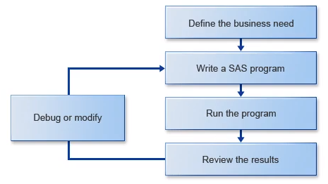

## Getting Started with SAS Programming
### Exploring SAS
#### Base SAS
Base SAS is the centerpiece of all SAS software. To extend the capabilities of Base SAS, you can add other SAS components.  

#### SAS Framework


#### Exploring the SAS Programming Process  



#### SAS Programming Steps
A SAS program is comprised of a sequence of steps, and a step is comprised of a sequence of statements. Every step has a beginning and ending boundary. A DATA step begins with a DATA statement, and a PROC step begins with a PROC statement.  


## Accessing Data
### Accessing SAS Libraries
Three SAS files: raw data file, SAS data set, SAS program.  

SAS data sets are stored in SAS libraries. A SAS **library** is a collection of one or more SAS files

A **libref** references a particular physical location. It refers to a group of SAS files in the same folder or directory.

### Using Two-level Data Set Names
One-level name: SAS assumes that the data set is stored in the *work* library. So, work is the default libref.  
Two-level name: to access data set is in a permanent library

### Creating and Accessing SAS libraries
A user-created library:
* Permanent  
* Must assign a libref to make it available in a SAS session.

The `LIBNAME` statement is a global statement. It's not part of a DATA or PROC step, and it doesn't need a RUN statement.   
```SAS
libname orion 'c:\oriondata';
```
