## SAS Querying and Reporting

### Working with Data in a Project  

#### Data Sets
The missing values in SAS data sets: missing character value is shown as blank; missing numeric value is displayed as a period.  

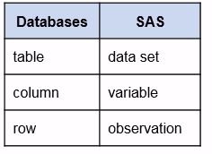

#### Data Sets Properties
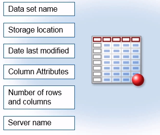

#### Column Attributes
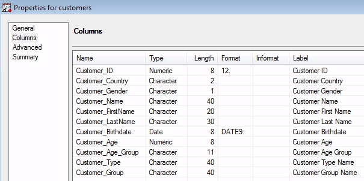
**Column Attributes: Name and Type**  
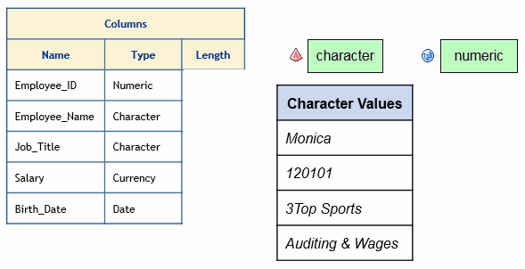  

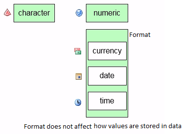  

**Column Attributes: Length**  
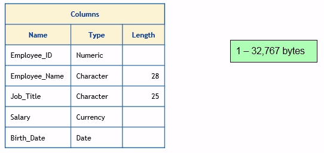  

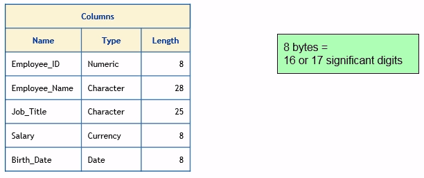  

**Column Attributes: Format, Informat and Label**  
The max length of Label is 256 Characters.  
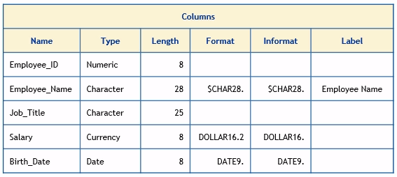  

Date is stored as the number of days before or after 01JAN1960.  
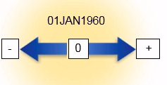  
Time is stored as the number of seconds from midnight.  
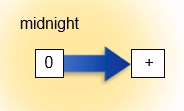  

#### Libraries  
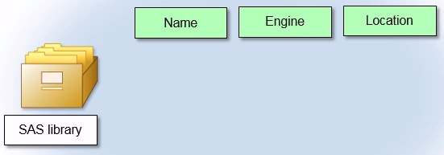  

A SAS Library is a collection of files that are defined, recognized, and accessible by SAS. To define a library, you specify a library name, an engine, and the location of the files.   
Name: 8 characters  
Engine: specifies the type of files you want to access  

When you view the libraries that are assigned on your default server, you might see libraries that Enterprise Guide assigns when you access local data and run a task or query. You might also see libraries that SAS automatically defines. For example, the Sashelp and Maps libraries are automatically assigned by SAS and include sample data and descriptive tables for maps that you can use. The Sasuser library is a permanent library for an individual user. If this library is defined, you can use it to store data that you want to access each time you open Enterprise Guide. The Work library points to a temporary folder.   

You can use the Assign Project Library task to define libraries to SAS or DBMS data sources for which you have Read permission. Libraries that you assign are cleared when you exit. The data is still there, but you must reassign the library when you start to access the data in the location that the library points to.  

### Getting Started with Tasks
#### Tasks
As you select options in a task, Enterprise Guide generates SAS code to submit to SAS for processing. The output of a task is generally a report, a data set, or both. n this course you learn about tasks in the Data, Describe, and Graph categories. There are also categories of statistical analyses, such as ANOVA, Regression, Multivariate, and so on.   

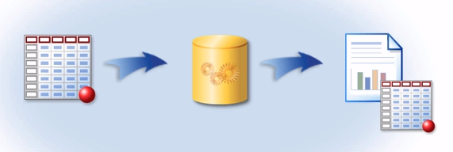  

### Creating Simple Queries
#### Queries Data  
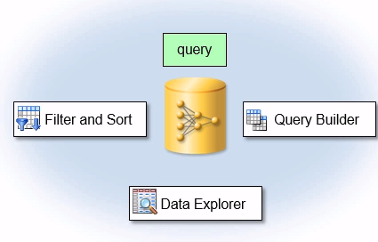

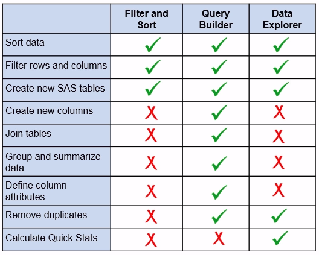

Three different tools you can use to manipulate or query your data: the Filter and Sort task, the Query Builder, and the Data Explore.  
