# MySQL Notes
Howard J, 12/22/2017  
Main reference: work of Jana Schaich Borg
Other reference: textbooks, websites, stackoverflows, etc.


## Database Basics
### Definitions
SQL, Structured Query Language, supports **set processing** (multiple records at-a-time).  The **relational model** separates the logical design of a database and its physical storage. This notion of **data independence** simplifies data modeling and database programming.

An **Entity** is some real-world thing, either physical, *customer*, *order* or conceptual, *work assignment*.  

An entity has **attributes**. An attribute is a discrete element of data, describing an entity and contain the entity’s data we want to store.  

An **instance** is a particular occurrence of an entity. To avoid confusion, each instance of an entity needs to be *uniquely identified*. An attribute or collection of attributes that uniquely identifies an instance of an entity is called an **identifier**.  

A collection of related files is a **database**. A **relational database** is a collection of relations.   

A **relation**, similar to the mathematical concept of a set, is a two-dimensional table arranged in rows and columns.  

In a relational database, each row must be uniquely identified, using **primry key**. **Entity integrity rule**, ensures that every row has a unique, non-null primary key.  


| Data Model | Relational Database | Equivalent 1 | Equivalent 2 |
| ---  | --- | --- | --- |
| Entity | Table | Relation | File |
| Attribute | Column  | Variable  |   |
| Record | Row | Observation |  |
| Field | Cell |  |  |
| Identifier | Primary Key  |   |   |


each entity becomes a table in a relational database, the entity name becomes the table
name, each attribute becomes a column, and each identifier becomes a primary key


### Database Normalization
**3NF**  
* Do not replicate data. Instead, reference data; point at data.  
* Use integers for keys and for references
* Add a special 'key' column to each table, which you will make references to.

**Three Kinds of Keys**  
*Primary Key:* generally an integer auto-increment field
*Logical Key:* what the outside world uses for lookup  
*Foreign Key:* generally an integer key pointing to a row in another table  
The best practice: never use your logical key as the primary key.

*Example:* in a table called *Album*  
| Name | Example | Type |
| ---  | --- | --- |
| Primary Key | album_id | numeric |
| Logical Key | title | string |
| Foreign Key | artist_id | numeric |


---

## Data Types
| Cateogry | Data Type | Description |
| ---  | --- | --- |
| Numeric | SMALLINT | A 15-bit signed binary value |
| Numeric | INTEGER  | A 31-bit signed binary value |
| Numeric | FLOAT (p) | A scientific format number of p binary digits precision |
| Numeric | DECIMAL(p,q) | A packed decimal number of p digits total length; q decimal spaces to the right of the decimal point may be |
| String | CHAR(n) | A fixed-length string of n characters |
| String | VARCHAR(n) | A variable-length string of up to n characters |
| String | TEXT | A variable-length string of up to 65,535 characters |
| Date / Time | DATE | in the form yyyymmdd |
| Date / Time | TIME | in the form hhmmss |
| Date / Time | TIMESTAMP | A combination of date and time to the nearest microsecond |
| Date / Time | TIME WITH TIME ZONE | Same as time, with the addition of an offset from universal time coordinated (UTC) of the specified time |
| Logical | BOOLEAN | A set of truth values: TRUE, FALSE, or UNKNOWN |


Sometimes empty strings are registered as non-NULL values.    
`WHERE breed_group IS NOT NULL AND breed_group!="None" AND breed_group!=""`

In Jupyter Notebook 'NULL' values are shown as 'None'.


## Naming Convention

Use underscores where you would naturally include a space in the name.  

**Database** name is a singular noun comprising one or more words, in lowercase joined with underscore `_`, e.g., dognitiondb.  

**Table** name is a plural noun comprising one or more words, in lowercase joined with underscore `_`, e.g., complete_tests, dogs. Do not prefix with *tbl* or any other such descriptive prefix or Hungarian notation. Avoid, where possible, concatenating two table names together to create the name of a relationship table. Rather than *cars_mechanics* prefer *services*. It is preferable not to use plural.      

**Alias**: column alias use camel style starting with a lower case. Table alias use camel style starting with a upper case.  

**Junction table** created to support many-to-many relationship between two tables may include both the table name, (e.g., *suppliers_products*, *moives_actors*) or an action verbs (e.g., *writes* (author writes books)).  

*MySQL displays database names and table names in lowercase, but column names in its original case.*  

It is a good practice NOT to include special characters, especially blank, in names. Avoid reserved words. Backquote the names, if they contain special characters, or are SQL reserved words, e.g., *date*, *order*, *Customer ID*. It is a good practice to always backquote the names in script.


---

## Relationship
### Many-to-many relationship
*Example:* Considering selling items. We can immediately identify two entities: *SALE* and *ITEM*. A sale can contain many items, and an type of item can appear in many sales. A **associative entity** to link the entities, it is called *LINE ITEM* in this example.  

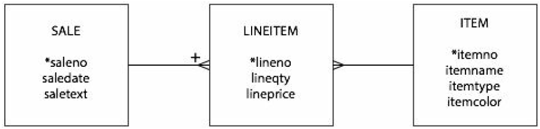  

In the m:m relationship figure, there is a plus sign (+) at the many end of the 1:m relationship between *SALE* and *LINEITEM*. A sales order is a series of lines, and *lineno* is unique only within a sale order. *lineno*, as an identifier, cannot guarantee that every instance of *LINEITEM* is unique. *saleno* and *lineno* can be used together as an unique identifier for every instance of *LINEITEM*.


---

## Exploratory
Database:  
`SHOW TABLES`

Table:  
`DESCRIBE tableName`
`SHOW COLUMNS FROM tableName`

Limit output:
`LIMIT 10 OFFSET 5`
`LIMIT 5, 10`

---

## Formatting Selected Data
### Alias
**for column**  
`SELECT dog_guid, created_at AS time_stamp`  
`SELECT dog_guid, created_at AS "time stamp"`   

**for table**  
`FROM complete_tests AS tests`  

### DISTINCT
Useful for:  
* Duplicate rows.    
* Multiple instances of the same value in a column.    

```SQL
SELECT DISTINCT breed
FROM dogs
```
  

```SQL
SELECT DISTINCT breed
FROM dogs
GROUP BY breed
```  
  

* When the `DISTINCT` clause is used with multiple columns, we get the combination of all the columns.  
```SQL
SELECT DISTINCT test_name, subcategory_name
FROM complete_tests
```
  


### Difference between `DISTINCT column_name`, `COUNT(DISTINCT column_name)` and `GROUP BY column_name`
If you want to infer the number of distinct entries from the results of a query using `JOIN` and `GROUP BY` clauses, remember to include an `IS NOT NULL` clause to ensure you are not counting 'NULL' values.  

* Include 'NULL' value:
```SQL
SELECT DISTINCT dog_guid
FROM complete_tests
```
  
```SQL
SELECT dog_guid
FROM complete_tests
GROUP BY dog_guid
```
  

* Exclude 'NULL' values:
```SQL
SELECT COUNT(DISTINCT dog_guid)
FROM complete_tests
```
  

### (Select and) Count Multiple Distinct Columns
Using subquery, we can count multiple distinct columns.  
```SQL
SELECT COUNT(*)
FROM (SELECT DISTINCT test_name, subcategory_name
      FROM complete_tests) AS distinct_tests
```
  


### ORDER BY
You include all the fields (or aliases) by which you want to sort the results after the ORDER BY clause, separated by commas, in the order you want them to be used for sorting.   
```sql
SELECT DISTINCT user_guid, state, membership_type
FROM users
WHERE country="US" AND state IS NOT NULL and membership_type IS NOT NULL
ORDER BY state ASC, membership_type ASC
```
  


### Jupyter Notebook Export
*Example:*  
`breed_list = %sql SELECT DISTINCT breed FROM dogs ORDER BY breed`  
`breed_list.csv('breed_list.csv')`  

### SQL string fuctions
*Example:*  
```SQL
SELECT DISTINCT breed,
REPLACE(breed,'-','') AS breed_fixed
FROM dogs
ORDER BY breed_fixed
```
```SQL
SELECT DISTINCT breed,
TRIM(LEADING '-' FROM breed) AS breed_fixed
FROM dogs
ORDER BY breed_fixed
```

---

## Summarise (aggregate)
Common aggregate functions, on a variable, across all observations:  
`AVG`, `COUNT`, `MAX`, `MIN`, `SUM`  

`COUNT` is used to report how many rows. When a column is included in a count function, null values are ignored in the count. When an asterisk is included in a count function, nulls are included in the count..

Two different counting scopes:  
* count the number of rows in a certain column, `COUNT(column_name)`  
* count the number of rows, `COUNT(*)`, which might take much longer time   

We can use it as a method to quickly know how many NULL values in a certain column.  

`COUNT(*) = COUNT(column_name) + SUM(ISNULL(column_name))`   

*Example:*  
```SQL
SELECT SUM(ISNULL(exclude))
FROM dogs
```

*Example:* Using `COUNT` and `SUM` to do the same thing. How many of these negative Duration entries are there?  
```SQL
SELECT COUNT(TIMESTAMPDIFF(MINUTE, start_time, end_time))
FROM exam_answers
WHERE TIMESTAMPDIFF(MINUTE, start_time, end_time) < 0
```
```SQL
SELECT SUM(TIMESTAMPDIFF(MINUTE, start_time, end_time) < 0)
FROM exam_answers
```


## Group By
### `GROUP BY` Clause
As a strong rule of thumb, if you are grouping by a column, you should also include that column in the SELECT statement. We can group by multiple columns or derived fields and MySQL allows you to use aliases in a group by clause
* To ensure the output is ordered in a way you intend, add an `ORDER BY` clause to your grouped query
* MySQL, allow you to use numbers in place of field names in the GROUP BY or ORDER BY fields to reduce the overall length of the queries.  
* Can query subsets of aggregated groups using the `HAVING` clause. Only computable at the aggregated group level

*Example:* examine the number of tests completed only during the winter holiday months of November and December. (Limits non-aggregated data.)
```SQL
SELECT test_name, MONTH(created_at) AS Month, COUNT(created_at) AS Num_Completed_Tests
FROM complete_tests
WHERE MONTH(created_at)=11 OR MONTH(created_at)=12
GROUP BY 1, 2
ORDER BY 3 DESC;
```

### Common `GROUP BY` mistake
MySQL allows user to mix grouped aggregated and non-aggregated data. The only way to be sure how the MySQL database will summarize a set of data in a SELECT clause is to tell it how to do so with an aggregate function.

*Example:* common mistake.
```SQL
SELECT test_name, MONTH(created_at) AS test_month, COUNT(created_at) AS test_count
FROM complete_tests
GROUP BY test_month
ORDER BY test_month ASC, test_name ASC
```

---

## JOIN
### Equijoin syntax Vs traditional join syntax
*Example:* write a query to output the dog_guid, breed group, state of the owner, and zip of the owner for each distinct dog in the Working, Sporting, and Herding breed groups.  
```SQL
SELECT DISTINCT d.dog_guid, d.breed_group, u.state, u.zip
FROM dogs d, users u
WHERE d.user_guid = u.user_guid
AND d.breed_group in ('Working', 'Sporting', 'Herding')
```
```SQL
SELECT DISTINCT d.dog_guid, d.breed_group, u.state, u.zip
FROM dogs d JOIN users u
  ON d.user_guid = u.user_guid
WHERE d.breed_group in ('Working', 'Sporting', 'Herding')
```


Without telling how the tables are related, *Cartesian product* will be performed. In other words, every single row of the dogs table will get paired with every single row of the reviews table.    

To prevent this from happening, tell the database how to relate the tables.    

### `INNER JOIN` or `JOIN`
* 'Equijoin' syntax:   
```SQL
FROM dogs d, reviews r
WHERE d.dog_guid = r.dog_guid AND d.user_guid = r.user_guid
```  
* Traditional syntax:  
```SQL
FROM dogs d JOIN reviews r
ON d.dog_guid = r.dog_guid AND d.user_guid = r.user_guid
```

### `LEFT/RIGHT OUTER JOIN` or `LEFT/RIGHT JOIN`
In this case, it becomes important to use the common variable from which table to select or group by.

*Example:*  it is very interesting to see that in *dogs* table all the *dog_guid* values `IS NULL`. After *users* table `LEFT JOIN` *dogs*, there are some `NULL` values in *dog_guid*.   

This example can also be used to calculate number of distinct fields that were in the left table, but not the right table.   

```SQL
SELECT dog_guid AS dDogID, breed
FROM dogs
WHERE dog_guid IS NULL
```
  

```SQL
SELECT u.user_guid AS uUserID, d.user_guid AS dUserID, d.dog_guid AS dDogID, d.breed
FROM users u LEFT JOIN dogs d
ON u.user_guid = d.user_guid
WHERE d.dog_guid IS NULL
```
  


### Duplicate Row / Field Values
*Cartesian product* applies. Each one of the rows in one table get paired up with each row in anther table that had the same field values.  

*Example:* Because of Cartesian product, the duplicate rows become $502 \times 1819 = 913138$. Since the duplicates for that field in this example exist in both tables, `JOIN` or `LEFT/RIGHT JOIN` produce the same Cartesian product result for that field.  

```SQL
SELECT COUNT(*)
FROM users
WHERE user_guid = 'ce7b75bc-7144-11e5-ba71-058fbc01cf0b'
```
  

```SQL
SELECT COUNT(*)
FROM dogs
WHERE user_guid = 'ce7b75bc-7144-11e5-ba71-058fbc01cf0b'
```
  

```SQL
SELECT u.user_guid AS uUserID, COUNT(*) AS rowCount
FROM users u LEFT JOIN dogs d
ON u.user_guid=d.user_guid
GROUP BY u.user_guid
ORDER BY rowCount DESC
```
  

```SQL
SELECT u.user_guid AS uUserID, COUNT(*) AS rowCount
FROM users u JOIN dogs d
ON u.user_guid=d.user_guid
GROUP BY u.user_guid
ORDER BY rowCount DESC
```
  


---

## Logical operators
Expressions that use logical operators return a result of "true" or "false", which is usually used to determine which, if any, subsequent parts of your query will be run.  


### IF
`IF` expressions are used to return one of two results based on whether inputs to the expressions meet the conditions you specify. They are frequently used in `SELECT` statements as a compact way to rename values in a column.   

The `IF` function is not supported by all database platforms, and some spell the function as `IIF`.   

`IF([your conditions],[result you want if conditions are met],[result you want if conditions are NOT met]) (AS [column name])`   

*Example:* a subquery with an `IF` statement to retrieve a list of unique *user_guid* with their classification as either an early or late user. Notice that `IF` expression creates a new non-aggregated column.    
```SQL
SELECT created_at, IF(created_at<'2014-06-01','early_user','late_user') AS userType
FROM users
```
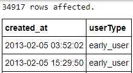  

*Example:* combine a subquery to filter duplicate *user_guids* in the *user* table.    
```SQL
SELECT CleanedUsers.user_guid as UserID,
       IF(CleanedUsers.firstAccount<'2014-06-01', 'early_user', 'late_user') AS userType
FROM (SELECT user_guid, MIN(created_at) AS firstAccount
      FROM users
      GROUP BY user_guid) AS CleanedUsers
```
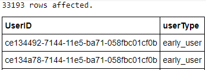  

*Example:* use `GROUP BY` statement to aggregate the output column from `IF`    
```SQL
SELECT IF(CleanedUsers.firstAccount<'2014-06-01', 'early_user', 'late_user') AS userType,
       COUNT(CleanedUsers.firstAccount)
FROM (SELECT user_guid, MIN(created_at) AS firstAccount
      FROM users
      GROUP BY user_guid) AS CleanedUsers
GROUP BY userType
```
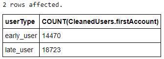  


*Example:* determine the number of unique user_guids who reside in the United States. Use a subquery to obtain distinct and not null data.  
```SQL
SELECT IF(country = 'US', 'in US',
         IF(country = 'N/A', 'Not Applicable', 'outside US')) AS userLocation,
       COUNT(user_guid) AS userCount
FROM (SELECT DISTINCT user_guid, country
      FROM users
      WHERE user_guid IS NOT NULL AND country IS NOT NULL) AS CleanedUsers
GROUP BY userLocation
```
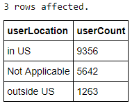  


### CASE  
The main purpose of `CASE` expressions is to return a singular value based on one or more conditional tests. You can think of `CASE` expressions as an efficient way to write a set of `IF` and `ELSEIF` statements.  

If an `ELSE` expression is omitted, `NULL` values will be outputted for all rows that do not meet any of the conditions stated explicitly in the expression `CASE` expressions can be used anywhere in a SQL statement, including in `GROUP BY`, `HAVING`, and `ORDER BY` clauses or the `SELECT` column list. You will find that `CASE` statements are useful in many contexts. For example, they can be used to rename or revise values in a column.  

#### If you need to manipulate values in a current column of your data:
```
CASE
  WHEN [condition set 1] THEN [result you want when the conditions in set 1 are met]
  WHEN [condition set 2] THEN [result you want when the conditions in set 2 are met]
  WHEN [condition set 3] THEN [result you want when the conditions in set 3 are met]
  ELSE [result you want when none of the condition sets are met]
END (AS [column name])
```
*Example:*  the same as the example above  
```SQL
SELECT CASE WHEN country="US" THEN "In US"
            WHEN country="N/A" THEN "Not Applicable"
            ELSE "Outside US"
            END AS userLocation,
      COUNT(user_guid) AS userCount  
FROM (SELECT DISTINCT user_guid, country
      FROM users
      WHERE country IS NOT NULL) AS CleanedUsers
GROUP BY userLocation
```

#### If you need to manipulate values in a current column of your data:
```
CASE [column name or expression]
  WHEN [value 1] THEN [result you want when value 1]
  WHEN [value 2] THEN [result you want when value 2]
  WHEN [value 3] THEN [result you want when value 3]
  ELSE [result you want when none of the rows equals to any of the specified values]
END (AS [column name])
```
*Example:*  the same as the example above    
```SQL
SELECT CASE country
            WHEN "US" THEN "In US"
            WHEN "N/A" THEN "Not Applicable"
            ELSE "Outside US"
            END AS userLocation,
      COUNT(user_guid) AS userCount  
FROM (SELECT DISTINCT user_guid, country
      FROM users
      WHERE country IS NOT NULL) AS CleanedUsers
GROUP BY userLocation
```


#### `CASE` and `IF` are equivalent, when conditional logic to output two groups  
*Example:* assume NULL values should be treated the same as "0" values in the exclude columns of the dogs and users tables.  
```SQL
SELECT dog_guid, exclude,
    CASE exclude
        WHEN "1" THEN "exclude"
        ELSE "keep"
    END AS excludeCleaned
FROM dogs
```
```SQL
SELECT dog_guid, exclude,
     IF(exclude = '1','exclude', 'keep') AS excludeCleaned
FROM dogs
```
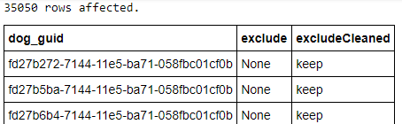  

#### the order of operations within logical expressions:
1: `NOT`  
2: `AND`  
3: `OR`  

*Example:* How many distinct dog_guids are found in group 1? compare the following two queries.  
```SQL
SELECT COUNT(DISTINCT dog_guid) AS dogCount,
CASE WHEN breed_group='Sporting' OR breed_group='Herding' AND exclude!='1' THEN "group 1"
     ELSE "everything else"
     END AS dogGroup
FROM dogs
GROUP BY dogGroup
```
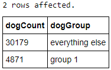

```SQL
SELECT COUNT(DISTINCT dog_guid) AS dogCount,
CASE WHEN exclude!='1' AND (breed_group='Sporting' OR breed_group='Herding') THEN "group 1"
     ELSE "everything else"
     END AS dogGroup
FROM dogs
GROUP BY dogGroup
```
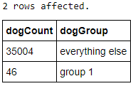


## Subqueries and Derived Tables
### Introduction
**Subqueries**, which are also sometimes called *inner queries* or *nested queries*, are queries that are embedded within the context of another query. The output of a subquery is incorporated into the queries that surround it. Subqueries can be used in `SELECT`, `WHERE`, and `FROM` clauses. When they are used in `FROM` clauses they create what are called *derived tables*.  

**The main reasons:**  
* Sometimes they are the most logical way to retrieve the information.  
* Sometimes they run faster than joins.  
* They can be used to isolate each logical part of a statement, which can be helpful for troubleshooting long and complicated queries.     

**Uniqueness:**  
* Must be enclosed in parentheses.  
* ORDER BY phrases cannot be used in subqueries (although ORDER BY phrases can still be used in outer queries that contain subqueries).
* Subqueries in SELECT or WHERE clauses that return more than one row must be used in combination with operators that are explicitly designed to handle multiple values, such as the IN operator. Otherwise, subqueries in SELECT or WHERE statements can output no more than 1 row.

### On the fly calculations
This allows you to use a summary calculation in your query without having to enter the value outputted by the calculation explicitly. A situation when this capability would be useful is if you wanted to see all the records that were greater than the average value of a subset of your data.

The subquery: calculating the average amount of time it took customers to complete all of the tests in the exam_answers table, excluding negative durations. Then compare TIMESTAMPDIFF to the singular average value outputted by the subquery surrounded by parentheses.  

*Example:* used in `WHERE` clause  
```SQL
SELECT *
FROM exam_answers
WHERE TIMESTAMPDIFF(MINUTE, start_time, end_time) >
    (SELECT AVG(TIMESTAMPDIFF(MINUTE, start_time, end_time)) AS AvgDuration
     FROM exam_answers
     WHERE TIMESTAMPDIFF(MINUTE, start_time, end_time) > 0);
```
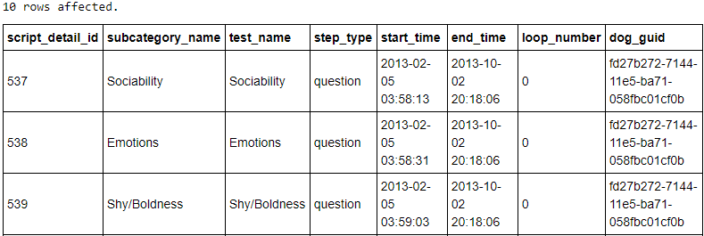


### Testing membership
Useful for assessing whether groups of rows are members of other groups of rows, with `IN`, `NOT IN`, `EXISTS`, and `NOT EXISTS` operators.  
`IN`, `NOT IN`: a condensed way of writing a sequence of OR statements.  

**`IN` vs `EXISTS`**  
* `EXISTS` and `NOT EXISTS` can only be used in subqueries.  
* `EXISTS` and `NOT EXISTS` are not preceded by a column name or any other expression.
* `EXISTS` and `NOT EXISTS` are logical statements, returning a value of TRUE or FALSE. As a practical consequence, the subqueries after EXISTS statements are often written `WHERE EXISTS (SELECT * ...)`  

*Example:* equivalent to `INNER JOIN`    
For each row from *users* table, check if there exists a row in the *dogs* table that meets the condition `u.user_guid =d.user_guid`. When you find the first matching row, stop right there - the `WHERE EXISTS` has been satisfied. The subquery is executed for each table row of the outer query.  
*Notice:* the inner query refers to the table of the outer query in this example.
```SQL
SELECT DISTINCT u.user_guid AS uUserID
FROM users u
WHERE EXISTS (SELECT *
              FROM dogs d
              WHERE u.user_guid = d.user_guid)
```
Equivalent code:  
```SQL
SELECT DISTINCT u.user_guid AS uUserID
FROM users u, dogs d
WHERE u.user_guid =d.user_guid
```
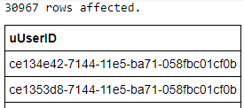


*Example:* calculate number of distinct fields that were in the left table, but not the right table. Same effect can be achieved using `LEFT JOIN`.   
```SQL
SELECT COUNT(DISTINCT user_guid)
FROM users u
WHERE NOT EXISTS (SELECT *
                  FROM dogs d
                  WHERE u.user_guid =d.user_guid)
```
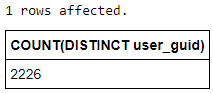


### Accurate logical representations of desired output and Derived Tables
A third situation in which subqueries can be useful is when they simply represent the logic of what you want better than joins.  

*Queries that include subqueries always run the innermost subquery first, and then run subsequent queries sequentially in order from the innermost query to the outermost query*. Since the subquery is in the `FROM` statement, it actually creates a temporary table, called a **derived table**, that is then incorporated into the rest of the query.  

First, *We are required to give an alias to any derived table we create in subqueries within FROM statements*.  

Second, we need to use this alias every time we want to execute a function that uses the derived table.  

Third, aliases used within subqueries can refer to tables outside of the subqueries. However, outer queries cannot refer to aliases created within subqueries unless those aliases are explicitly part of the subquery output.

Fourth, when you use subqueries in `FROM` statements, the temporary table you create can have multiple columns in the output (unlike when you use subqueries in outside `SELECT` statements). But for that same reason, subqueries in `FROM` statements can be very computationally intensive. Therefore, it's a good idea to use them sparingly, especially when you have very large data sets.  


*Example:* wanted a list of each dog that a user in the *users* table owns, with its accompanying breed information whenever possible.  
*Notice:* "exploding rows" phenomenon due to duplicate rows.
```SQL
SELECT u.user_guid AS uUserID, d.user_guid AS dUserID, d.dog_guid AS dDogID, d.breed
FROM users u LEFT JOIN dogs d
  ON u.user_guid=d.user_guid
```


*Example:* to find out how many duplications:
```SQL
SELECT u.user_guid AS uUserID, d.user_guid AS dUserID, count(*) AS numrows
FROM users u LEFT JOIN dogs d
  ON u.user_guid=d.user_guid
GROUP BY u.user_guid
ORDER BY numrows DESC
```


*Example:* take a look the duplicate data:
*Notice:* an alias of *DistinctUUsersID* is used to name the results of the subquery.
```SQL
SELECT DistictUUsersID.user_guid AS userid, d.breed, d.weight, count(*) AS numrows
FROM (SELECT DISTINCT u.user_guid
      FROM users u) AS DistictUUsersID
LEFT JOIN dogs d
  ON DistictUUsersID.user_guid = d.user_guid
GROUP BY DistictUUsersID.user_guid
HAVING numrows>10
ORDER BY numrows DESC;
```


*Example:* We could simply join the distinct *user_guid* from the *users* table in the first place:  
```SQL
SELECT DistinctUUsersID.user_guid AS uUserID, d.user_guid AS dUserID, count(*) AS numrows
FROM (SELECT DISTINCT u.user_guid
      FROM users u) AS DistinctUUsersID
LEFT JOIN dogs d
  ON DistinctUUsersID.user_guid = d.user_guid
GROUP BY DistinctUUsersID.user_guid
ORDER BY numrows DESC
```


*Example:* also select the distinct *user_guid* from the *dogs* table:  
```SQL
SELECT DistinctUUsersID.user_guid AS uUserID, DistinctDUserID.user_guid AS dUserID, count(*) AS numRows
FROM (SELECT DISTINCT u.user_guid
      FROM users u) AS DistinctUUsersID
LEFT JOIN (SELECT DISTINCT d.user_guid
           FROM dogs d) AS DistinctDUserID
  ON DistinctUUsersID.user_guid = DistinctDUserID.user_guid
GROUP BY DistinctUUsersID.user_guid
ORDER BY numRows DESC;
```


*Example:* now we are ready to extract multiple columns as we know no duplicate row exists:
```SQL
SELECT DistinctUUsersID.user_guid AS uUserID, DistictDUsersID.user_guid AS dUserID,
DistictDUsersID.dog_guid AS DogID, DistictDUsersID.breed AS breed
FROM (SELECT DISTINCT u.user_guid
      FROM users u
      LIMIT 100) AS DistinctUUsersID
LEFT JOIN (SELECT DISTINCT d.user_guid, d.dog_guid, d.breed
            FROM dogs d) AS DistictDUsersID
  ON DistinctUUsersID.user_guid = DistictDUsersID.user_guid
GROUP BY DistinctUUsersID.user_guid;
```


## Case Study
Q:  How many unique DogIDs are summarized in the Dognition dimensions labeled "None" or ""?
```SQL
SELECT dimension, COUNT(DISTINCT dog_guid)
FROM dogs
WHERE dimension IS NULL OR dimension = ''
GROUP BY dimension
```
```SQL
SELECT dimension, COUNT(dog_guid)
FROM (SELECT DISTINCT dog_guid, dimension
    FROM dogs
    WHERE dimension IS NULL OR dimension = '') AS dimensionNull
GROUP BY dimension
```
