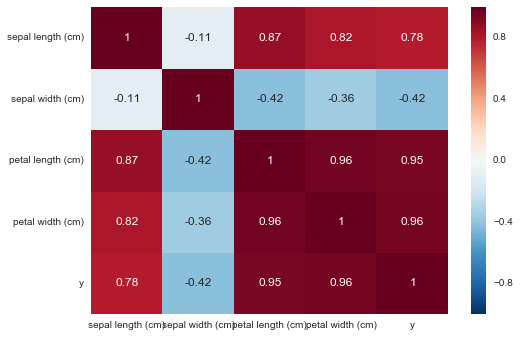
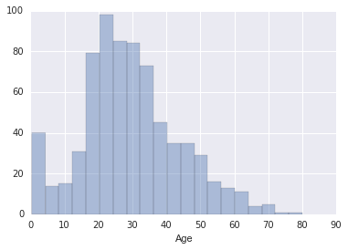
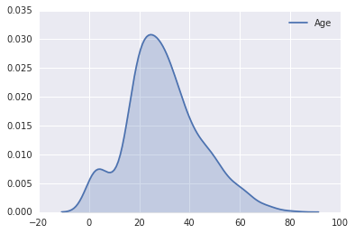
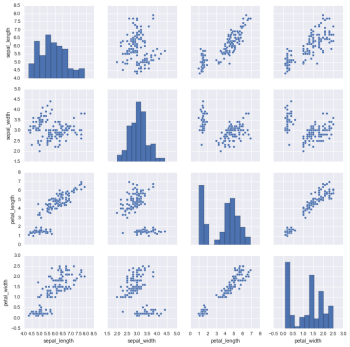
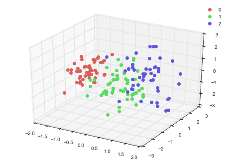
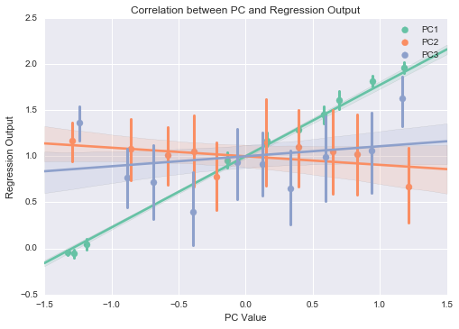
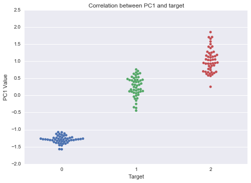
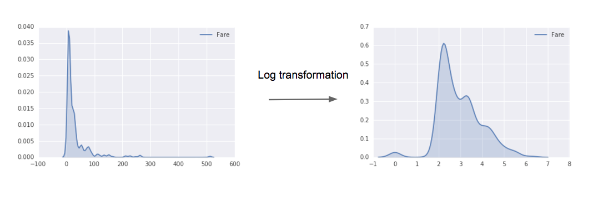

# ML Cheatsheet
ShuaiW

Assuming we have the dataset in a loadable format (e.g., csv), here are the steps
we follow to complete a machine learning project.

0. [Exploratory data analysis](#exploratory-data-analysis)
0. [Preprocessing](#preprocessing)
0. [Feature engineering](#feature-engineering)
0. [Machine learning](#machine-learning)

A couple of notes before we go on.

First of all, machine learning is a highly iterative field. This would entail
a loop cycle of the above steps, where each cycle is based on the feedback from
the previous cycle, with the goal of improving the model performance. One
example is that we need refit models when we engineered new features, and
test to see if these features are predicative.

Second, while in Kaggle competitions one can create a monster ensemble of models, in
production system often times such ensembles are not useful. They are
high maintenance, hard to interpret, and too complex to deploy. This is why
in practice it's often simpler model plus huge amount of data that wins.

Third, while some code snippets are reusable, each dataset has its own
uniqueness. Dataset-specific efforts are needed to build better models.

Bearing these points in mind, let's get our hands dirty.


## Exploratory data analysis

Exploratory data analysis (EDA) is an approach to analyze data sets to summarize their main characteristics,
often with plots. The goal of EDA is to get a deeper understanding of the
dataset, and to preprocess data and engineer features more effectively. Here
are some generic code snippets that can be applied to any structured dataset


import libraries
```python
import os
import fnmatch
import glob
import numpy as np
import pandas as pd
import matplotlib.pyplot as plt
import seaborn as sns
```

data I/O
```python
df = pd.read_csv(file_path) # read in csv file as a DataFrame
df.to_csv(file_path, index=False) # save a DataFrame as csv file

# read all csv under a folder and concatenate them into a big dataframe
path = r'path'

# flat
all_files = glob.glob(os.path.join(path, "*.csv"))

# or recursively
all_files = [os.path.join(root, filename)
             for root, dirnames, filenames in os.walk(path)
             for filename in fnmatch.filter(filenames, '*.csv')]

df = pd.concat((pd.read_csv(f) for f in all_files))
```

data I/O zipped

```python
import pandas as pd
import zipfile

zf_path = 'file.zip'
zf = zipfile.ZipFile(zf_path) # zipfile.ZipFile object
all_files = zf.namelist() # list all zipped files
all_files = [f for f in all_files if f.endswith('.csv')] # e.g., get only csv
df = pd.concat((pd.read_csv(zf.open(f)) for f in all_files)) # concat all zipped csv into one dataframe
```

To a table in sqlite3 DB (then you can use [DB Browser for SQLite](http://sqlitebrowser.org/) to view and query the table)

```python
import sqlite3
import pandas as pd

df = pd.read_csv(csv_file) # read csv file
sqlite_file = 'my_db.sqlite3'
conn = sqlite3.connect(sqlite_file) # establish a sqlite3 connection

# if db file exists append the csv
df.to_sql(tablename, conn, if_exists='append', index=False)
```


data summary
```python
df.head() # return the first 5 rows
df.describe() # summary statistics, excluding NaN values
df.info(verbose=True, null_counts=True) # concise summary of the table
df.shape # shape of dataset
df.skew() # skewness for numeric columns
df.kurt() # unbiased kurtosis for numeric columns
df.get_dtype_counts() # counts of dtypes
```

display missing value proportion for each col
```python
for c in df.columns:
  num_na = df[c].isnull().sum()
  if num_na > 0:
    print round(num_na / float(len(df)), 3), '|', c
```


pairwise correlation of columns
```python
df.corr()
```


### plotting

plot heatmap of correlation matrix (of all numeric columns)
```python
cm = np.corrcoef(df.T)
sns.heatmap(cm, annot=True, yticklabels=df.columns, xticklabels=df.columns)
```



plot univariate distributions
```python
# single column
sns.distplot(df['col1'].dropna())

# all numeric columns
for c in df.columns:
  if df[c].dtype in ['int64', 'float64']:
    sns.distplot(df[c].dropna(), kde=False)
    plt.show()
```



plot kernel density estimaton (KED)
```python
# all continuous variables
for c in df.columns:
  if df[c].dtype in ['float64']:
    sns.kdeplot(df[c].dropna(), shade=True)
    plt.show()
```



plot pairwise relationships
```python
sns.pairplot(df.dropna())
```



**[hypertools](https://github.com/ContextLab/hypertools) is a python toolbox for
visualizing and manipulating high-dimensional data. This is desirable for the EDA
phase.**

visually explore relationship between features and target (in 3D space)
```python
import hypertools as hyp
import seaborn as sns
from sklearn import datasets

iris = datasets.load_iris()
X = iris.data
y = iris.target
hyp.plot(X,'o', group=y, legend=list(set(y)), normalize='across')
```




linear regression analysis using each PC
```python
from sklearn import linear_model
sns.set(style="darkgrid")
sns.set_palette(palette='Set2')

data = pd.DataFrame(data=X, columns=iris.feature_names)
reduced_data = hyp.reduce(hyp.tools.df2mat(data), ndims=3)

linreg = linear_model.LinearRegression()
linreg.fit(reduced_data, y)

sns.regplot(x=reduced_data[:,0],y=linreg.predict(reduced_data), label='PC1',x_bins=10)
sns.regplot(x=reduced_data[:,1],y=linreg.predict(reduced_data), label='PC2',x_bins=10)
sns.regplot(x=reduced_data[:,2],y=linreg.predict(reduced_data), label='PC3',x_bins=10)

plt.title('Correlation between PC and Regression Output')
plt.xlabel('PC Value')
plt.ylabel('Regression Output')
plt.legend()
plt.show()
```



break down by labels
```python
sns.set(style="darkgrid")
sns.swarmplot(y,reduced_data[:,0],order=[0, 1, 2])
plt.title('Correlation between PC1 and target')
plt.xlabel('Target')
plt.ylabel('PC1 Value')
plt.show()
```



For more use cases of hypertools, check [notebooks](https://github.com/ContextLab/hypertools-paper-notebooks)
 and [examples](http://hypertools.readthedocs.io/en/latest/auto_examples/index.html)


## Preprocessing

drop columns
```python
df.drop([col1, col2, ...], axis=1, inplace=True) # in place
new_df = df.drop([col1, col2, ...], axis=1) # create new df (overhead created)
```

handle missing values
```python
# fill with mode, mean, or median
df_mode, df_mean, df_median = df.mode().iloc[0], df.mean(), df.median()

df_fill_mode = df.fillna(df_mode)
df_fill_mean = df.fillna(df_mean)
df_fill_median = df.fillna(df_median)

# drop col with any missing values
df_drop_na_col = df.dropna(axis=1)
```

encode categorical features
```python
from sklearn.preprocessing import LabelEncoder

df_col = df.columns
col_non_num = [c for c in df_col if df[c].dtype == 'object']
for c in col_non_num:
  df[c] = LabelEncoder().fit_transform(df[c])
```


join two tables/dataframes
```python
df1.join(df2, on=col)
```

handle outliners (outliers can either be clipped, or removed.
**WARNING**: outliers are not always meant to be removed)

In the following example we assume df is all numeric, and has no missing values

clipping
```python
# clip outliers to 3 standard deviation
lower = df.mean() - df.std()*3
upper = df.mean() + df.std()*3
clipped_df = df.clip(lower, upper, axis=1)
```

removal
```pyhton
# remove rows that have outliers in at least one column
new_df = df[(np.abs(stats.zscore(df)) < 3).all(axis=1)]
```

filter
```python
# filter by one value
new_df = df[df.col==val]

# filter by multiple values
new_df = df[df.col.isin(val_list)]
```

## Feature engineering

### Transformation

one-hot encode categorical features; not necessary for tree-based algorithms
```python
# for a couple of columns
one_hot_df = pd.get_dummies(df[[col1, col2, ...]])

# for the whole dataframe
new_df = pd.get_dummies(df)
```

normalize numeric features (to range [0, 1])
```python
from sklearn.preprocessing import MinMaxScaler

scaler = MinMaxScaler()
normalized_df = MinMaxScaler().fit_transform(df)
```

log transformation: for columns with highly skewed distribution, we can apply
the log transformation
```python
from scipy.special import log1p
transformed_col = df[col].apply(log1p)
```




### Creation

Feature creation is both domain and engineering efforts. With the help from
domain experts, we can craft more predicative features, but here are some generic
feature creation methods worth trying on any structured dataset

add feature: number of missing values
```python
df['num_null'] = df.isnull().sum(axis=1)
```

add feature: number of zeros
```python
df['num_zero'] = (df == 0).sum(axis=1)
```

add feature: binary value for each feature indicating whether a data point is null
```python
for c in df:
  if pd.isnull(df[c]).any():
    df[c+'-ISNULL'] = pd.isnull(df[c])
```

add feature interactions
```python
from sklearn.preprocessing import PolynomialFeatures

# e.g., 2nd order interaction
poly = PolynomialFeatures(degree=2)
# numpy array of transformed df
arr = poly.fit_transform(df)
# all features names
target_feature_names = ['x'.join(
    ['{}^{}'.format(pair[0], pair[1]) for pair in tuple if pair[1] != 0])
    for tuple in [zip(X_train.columns, p) for p in poly.powers_]]
new_df = pd.DataFrame(arr, columns=target_feature_names)
```

### Selection

There are [various ways](http://scikit-learn.org/stable/modules/feature_selection.html)
to select features, and an effective one is recursive feature elimination (RFE).

select feature using RFE

```python
from sklearn.feature_selection import RFE

model = ... # a sklean's classifier that has either 'coef_' or 'feature_importances_' attribute
num_feautre = 10 # say we want the top 10 features

selector = RFE(model, num_feature, step=1)
selector.fit(X_train, y_train) # select features
feature_selected = list(X_train.columns[selector.support_])

model.fit(X_train[feature_selected], y_train) # re-train a model using only selected features
```

For more feature engineering methods please refer to this
[blogpost](https://www.linkedin.com/pulse/feature-engineering-data-scientists-secret-sauce-ashish-kumar).


## Machine learning

### Cross validation (CV) strategy

Theories first (some adopted from Andrew Ng). In machine learning we usually have the following subsets of data:

* **training set** is used to run the learning algorithm on
* **dev set** (or hold out cross validation set) is used to tune parameters,
select features, and make other decisions regarding the learning algorithm
* **test set** is used to evaluate the performance of the algorithms,
but NOT to make any decisions about what algorithms or parameters to use

Ideally, those 3 sets should come from the same distribution, and
reflect what data you expect to get in the future and want to do well on.

If we have real-world application from which we continuously collect new data,
then we can train on historical data, and split the in-coming data into dev and
test sets. This is out of the scope of this cheatsheet. The following exmample
assume we have a csv file and we want to train a best model on this snapshot.

How should we split the the three sets? Here is one good CV strategy

* training set the larger the merrier of course :)
* dev set should be large enough to detect differences between algorithms
(e.g., classifier A has 90% accuracy and classifier B has 90.1% then a dev
set of 100 examples would not be able to detect this 0.1% difference.
Something around the 1,000 to 10,000 will do)
* test set should be large enough to give high confidence in the overall
performance of the system (do not naively use 30% of the data)

Sometimes we can be pretty data strapped (e.g., 1000 data points), and a compromising
strategy is 70%/15%/15% for train/dev/test sets, as follows:

```python
from sklearn.model_selection import train_test_split

# set seed for reproducibility & comparability
seed = 2017

X_train, X_other, y_train, y_other = train_test_split(
  X, y, test_size=0.3, random_state=seed)
X_dev, X_test, y_dev, y_test = train_test_split(
  X_rest, y_rest, test_size=0.5, random_state=seed)
```

As noted we need to seed the split.

If we have class imbalance issue, we should split the data in a stratified way
(using the label array):

```python
X_train, X_other, y_train, y_other = train_test_split(
  X, y, test_size=0.3, random_state=seed, stratify=y)
```

### Model training

If we've got so far, training is actually the easier part. We just initialize
a classifier and train it!

```python
from sklearn.linear_model import LogisticRegression

clf = LogisticRegression()
clf.fit(X_train, X_test)
```

### Evaluation

Having a single-number evaluation metric allows us to sort all models according
to their performance on this metric and quickly decide what is working best.
In production system if we have multiple (N) evaluation metrics, we can set
N-1 of the criteria as 'satisficing' metrics, i.e., we simply require that
they meet a certain value, then define the final one as the 'optimizing' metric
which we directly optimize.

Here is an example of evaluating a model with Area Under the Curve (AUC)

```python
from sklearn.metrics import roc_auc_score

y_pred = clf.predict(X_test)
print 'ROC score: {}'.format(roc_auc_score(y_test, y_pred))
```

### Hyperparameter tuning

example of nested cross-validation

```python
import numpy as np
from sklearn.grid_search import GridSearchCV
from sklearn.cross_validation import cross_val_score
from sklearn.ensemble import RandomForestClassifier

X_train = ... # your training features
y_train = ... # your training labels

gs = GridSearchCV(
  estimator = RandomForestClassifier(random_state=0),
  param_grid = {
    'n_estimators': [100, 200, 400, 600, 800],
     # other params to tune
     }
  scoring = 'roc_auc',
  cv = 5
)

scores = cross_val_score(
  gs,
  X_train,
  y_train,
  scoring = 'roc_auc',
  cv = 2
)

print 'CV roc_auc: %.3f +/- %.3f' % (np.mean(scores), np.std(scores))
```

### Ensemble

Please refer to the last section of this
[blogpost](https://shuaiw.github.io/2016/07/19/data-science-project-workflow.html).
