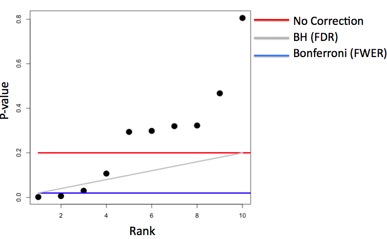

## Power
* **Power** = probability of rejecting the null hypothesis when it is false (the more power the better)
    * most often used in designing studies so that there's a reasonable chance to detect the alternative hypothesis if the alternative hypothesis is true
* $\beta$ = probability of type II error = failing to reject the null hypothesis when it's false
* power = $1 - \beta$
* ***example***
    * $H_0: \mu = 30 \to \bar X \sim N(\mu_0, \sigma^2/n)$
    * $H_a: \mu > 30 \to \bar X \sim N(\mu_a, \sigma^2/n)$
    * Power: $$Power = P\left(\frac{\bar X - 30}{s /\sqrt{n}} > t_{1-\alpha,n-1} ~;~ \mu = \mu_a \right)$$
        * ***Note**: the above function depends on value of $\mu_a$ *
        * ***Note**: as $\mu_a$ approaches 30, power approaches $\alpha$ *
	* assuming the sample mean is normally distributed, $H_0$ is rejected when $\frac{\bar X - 30}{\sigma /\sqrt{n}} > Z_{1-\alpha}$
    * or, $\bar X > 30 + Z_{1-\alpha} \frac{\sigma}{\sqrt{n}}$
* R commands:
    * `alpha = 0.05; z = qnorm(1-alpha)` $\rightarrow$ calculates $Z_{1-\alpha}$
    * `pnorm(mu0 + z * sigma/sqrt(n), mean = mua, sd = sigma/sqrt(n), lower.tail = FALSE)` $\rightarrow$ calculates the probability of getting a sample mean that is larger than $Z_{1-\alpha} \frac{\sigma}{\sqrt{n}}$ given that the population mean is $\mu_a$
        * ***Note**: using `mean = mu0` in the function would = $\alpha$ *
    * Power curve behavior
        * Power increases as $mu_a$ increases $\rightarrow$ we are more likely to detect the difference in $mu_a$ and $mu_0$
        * Power increases as **n** increases $\rightarrow$ with more data, more likely to detect any alternative $mu_a$

```{r, fig.align='center', fig.height=4, fig.width=6}
library(ggplot2)
mu0 = 30; mua = 32; sigma = 4; n = 16
alpha = 0.05
z = qnorm(1 - alpha)
nseq = c(8, 16, 32, 64, 128)
mu_a = seq(30, 35, by = 0.1)
power = sapply(nseq, function(n)
    pnorm(mu0 + z * sigma / sqrt(n), mean = mu_a, sd = sigma / sqrt(n),
          lower.tail = FALSE)
    )
colnames(power) <- paste("n", nseq, sep = "")
d <- data.frame(mu_a, power)
library(reshape2)
d2 <- melt(d, id.vars = "mu_a")
names(d2) <- c("mu_a", "n", "power")
g <- ggplot(d2,
            aes(x = mu_a, y = power, col = n)) + geom_line(size = 2)
g
```


* **Solving for Power**
    * When testing $H_a : \mu > \mu_0$ (or $<$ or $\neq$)
        $$Power = 1 - \beta = P\left(\bar X > \mu_0 + Z_{1-\alpha} \frac{\sigma}{\sqrt{n}} ; \mu = \mu_a \right)$$
        where $\bar X \sim N(\mu_a, \sigma^2 / n)$
    * Unknowns = $\mu_a$, $\sigma$, $n$, $\beta$
    * Knowns = $\mu_0$, $\alpha$
    * Specify any 3 of the unknowns and you can solve for the remainder; most common are two cases
        1. Given power desired, mean to detect, variance that we can tolerate, find the **n** to produce desired power (designing experiment/trial)
        2. Given the size **n** of the sample, find the power that is achievable (finding the utility of experiment)
    * ***Note**: for $H_a: \mu \neq mu_0$, calculated one-sided power using $z_{1-\alpha / 2}$; however, the power calculation here exclusdes the probability of getting a large TS in the opposite direction of the truth, but this is only applicable when $\mu_a$ and $\mu_0$ are close together*

* **Power Behavior**
    * Power increases as $\alpha$ becomes larger
    * Power of one-sided test $>$ power of associated two-sided test
    * Power increases as $\mu_a$ gets further away from $\mu_0$
    * Power increases as **n** increases (sample mean has less variability)
    * Power increases as $\sigma$ decreases (again less variability)
    * Power usually depends only $\frac{\sqrt{n}(\mu_a - \mu_0)}{\sigma}$, and not $\mu_a$, $\sigma$, and $n$
        * **effect size** = $\frac{\mu_a - \mu_0}{\sigma}$ $\rightarrow$ unit free, can be interpretted across settings

* **T-test Power**
    * for Gossett's T test,
    $$Power = P\left(\frac{\bar X - \mu_0}{S/\sqrt{n}} > t_{1-\alpha, n-1} ; \mu = \mu_a \right)$$
        * $\frac{\bar X - \mu_0}{S/\sqrt{n}}$ does not follow a t distribution if the true mean is $\mu_a$ and NOT $\mu_0$ $\rightarrow$ follows a non-central t distribution instead
    * `power.t.test` = evaluates the non-central t distribution and solves for a parameter given all others are specified
        * `power.t.test(n = 16, delta = 0.5, sd = 1, type = "one.sample", alt = "one.sided")$power` = calculates power with inputs of n, difference in means, and standard deviation
            * `delta` = argument for difference in means
            * ***Note**: since effect size = `delta/sd`, as `n`, `type`, and `alt` are held constant, any distribution with the same effect size will have the same power *
        * `power.t.test(power = 0.8, delta = 0.5, sd = 1, type = "one.sample", alt = "one.sided")$n` = calculates size n with inputs of power, difference in means, and standard deviation
            * ***Note**: n should always be rounded up (ceiling) *


## Multiple Testing
* Hypothesis testing/significant analysis commonly overused
* correct for multiple testing to avoid false positives/conclusions (two key components)
    1. error measure
    2. correction
* multiple testing is needed because of the increase in  ubiquitous data collection technology and analysis
    * DNA sequencing machines
    * imaging patients in clinical studies
    * electronic medical records
    * individualized movement data (fitbit)

### Type of Errors

 | Actual $H_0$ = True | Actual $H_a$ = True |  Total
----------------------|--------------|--------------|---------
Conclude $H_0$ = True (non-significant) |      $U$     |      $T$     |  $m-R$
Conclude $H_a$ = True (significant) |      $V$     |      $S$     |   $R$
**Total**               |     $m_0$    |    $m-m_0$   |   $m$

* **$m_0$** = number of true null hypotheses, or cases where $H_0$ = actually true (unknown)
* **$m - m_0$** = number of true alternative hypotheses, or cases where $H_a$ = actually true (unknown)
* **$R$** = number of null hypotheses rejected, or cases where $H_a$ = concluded to be true (measurable)
* **$m - R$** = number of null hypotheses that failed to be rejected, or cases where $H_0$ = concluded to be true (measurable)
* **$V$** = Type I Error / false positives, concludes $H_a$ = True when $H_0$ = actually True
* **$T$** = Type II Error / false negatives, concludes $H_0$ = True when $H_a$ = actually True
* **$S$** = true positives, concludes $H_a$ = True when $H_a$ = actually True
* **$U$** = true negatives, concludes $H_0$ = True when $H_0$ = actually True

### Error Rates
* ***false positive rate*** = rate at which false results are called significant $E[\frac{V}{m_0}]$ $\rightarrow$ average fraction of times that $H_a$ is claimed to be true when $H_0$ is actually true
	* ***Note**: mathematically equal to type I error rate $\rightarrow$ false positive rate is associated with a post-prior result, which is the expected number of false positives divided by the total number of hypotheses under the real combination of true and non-true null hypotheses (disregarding the "global null" hypothesis). Since the false positive rate is a parameter that is not controlled by the researcher, it cannot be identified with the significance level, which is what determines the type I error rate. *
* ***family wise error rate (FWER)*** = probability of at least one false positive $Pr(V \ge 1)$
* ***false discovery rate (FDR)*** = rate at which claims of significance are false $E[\frac{V}{R}]$

* **controlling error rates (adjusting $\alpha$)**
    * false positive rate
        * if we call all $P<\alpha$ significant (reject $H_0$), we are expected to get $\alpha \times m$ false positives, where $m$ = total number of hypothesis test performed
        * with high values of $m$, false positive rate is very large as well
    * family-wise error rate (FWER)
        * controlling FWER = controlling the probability of even one false positive
        * *bonferroni* correction (oldest multiple testing correction)
            * for $m$ tests, we want $Pr(V \ge 1) < \alpha$
            * calculate P-values normally, and deem them significant if and only if $P < \alpha_{fewer} = \alpha / m$
        * easy to calculate, but tend to be very ***conservative***
    * false discovery rate (FDR)
        * most popular correction = controlling FDR
        * for $m$ tests, we want $E[\frac{V}{R}] \le \alpha$
        * calculate P-values normally and sort some from smallest to largest $\rightarrow$ $P_{(1)},P_{(1)}, ... , P_{(m)}$
        * deem the P-values significant if $P_{(i)} \le \alpha \times \frac{i}{m}$
        * easy to calculate, less conservative, but allows for more false positives and may behave strangely under dependence (related hypothesis tests/regression with different variables)
    * ***example***
        * 10 P-values with $\alpha = 0.20$

        

* **adjusting for p-values**
    * ***Note**: changing P-values will fundamentally change their properties but they can be used directly without adjusting $/alpha$ *
    * _bonferroni_ (FWER)
        * $P_i^{fewer} = max(mP_i, 1)$ $\rightarrow$ since p cannot exceed value of 1
        * deem P-values significant if $P_i^{fewer} < \alpha$
        * similar to controlling FWER

### Example

```{r}
set.seed(1010093)
pValues <- rep(NA,1000)
for(i in 1:1000){
  x <- rnorm(20)
  # First 500 beta=0, last 500 beta=2
  if(i <= 500){y <- rnorm(20)}else{ y <- rnorm(20,mean=2*x)}
  # calculating p-values by using linear model; the [2, 4] coeff in result = pvalue
  pValues[i] <- summary(lm(y ~ x))$coeff[2,4]
}
# Controls false positive rate
trueStatus <- rep(c("zero","not zero"),each=500)
table(pValues < 0.05, trueStatus)
# Controls FWER
table(p.adjust(pValues,method="bonferroni") < 0.05,trueStatus)
# Controls FDR (Benjamin Hochberg)
table(p.adjust(pValues,method="BH") < 0.05,trueStatus)
```


## Resample Inference
* **Bootstrap** = useful tool for constructing confidence intervals and caclulating standard errors for difficult statistics
    * ***principle*** = if a statistic's (i.e. median) sampling distribution is unknown, then use distribution defined by the data to approximate it
    * ***procedures***
        1. simulate $n$ observations **with replacement** from the observed data $\rightarrow$ results in $1$ simulated complete data set
        2. calculate desired statistic (i.e. median) for each simulated data set
        3. repeat the above steps $B$ times, resulting in $B$ simulated statistics
        4. these statistics are approximately drawn from the sampling distribution of the true statistic of $n$ observations
        5. perform one of the following
            * plot a histogram
            * calculate standard deviation of the statistic to estimate its standard error
            * take quantiles (2.5^th^ and 97.5^th^) as a confidence interval for the statistic ("_bootstrap CI_")
    * ***example***
        * Bootstrap procedure for calculating confidence interval for the median from a data set of $n$ observations $\rightarrow$ approximate sampling distribution

```{r fig.align='center', fig.height=4, fig.width=6, message = F, warning = F}
# load data
library(UsingR); data(father.son)
# observed dataset
x <- father.son$sheight
# number of simulated statistic
B <- 1000
# generate samples
resamples <- matrix(
    sample(x,               # sample to draw frome
           n * B,           # draw B datasets with n observations each
           replace = TRUE), # cannot draw n*B elements from x (has n elements) without replacement
    B, n)                   # arrange results into n x B matrix
                            # (every row = bootstrap sample with n observations)
# take median for each row/generated sample
medians <- apply(resamples, 1, median)
# estimated standard error of median
sd(medians)
# confidence interval of median
quantile(medians, c(.025, .975))
# histogram of bootstraped samples
hist(medians)
```

* ***Note:** better percentile bootstrap confidence interval = "bias corrected and accelerated interval" in `bootstrap` package*

* **Permutation Tests**
    * ***procedures***
        * compare groups of data and test the null hypothesis that the distribution of the observations from each group = same
            * ***Note**: if this is true, then group labels/divisions are irrelevant *
        * permute the labels for the groups
        * recalculate the statistic
            * Mean difference in counts
            * Geometric means
            * T statistic
        * Calculate the percentage of simulations where the simulated statistic was more extreme (toward the alternative) than the observed
    * ***variations***

        Data type | Statistic | Test name
---|---|---|
Ranks | rank sum | rank sum test
Binary | hypergeometric prob | Fisher's exact test
Raw data | | ordinary permutation test

        * ***Note**: randomization tests are exactly permutation tests, with a different motivation *
        * For matched data, one can randomize the signs
        * For ranks, this results in the **signed rank test**
        * Permutation strategies work for regression by permuting a regressor of interest
        * Permutation tests work very well in multivariate settings
    * ***example***
        * we will compare groups **B** and **C** in this dataset for null hypothesis $H_0:$ there are no difference between the groups

```{r, fig.height=4, fig.width=6, echo=FALSE, fig.align='center'}
# load data
data(InsectSprays)
# plot boxplot of dataset
ggplot(InsectSprays, aes(spray, count, fill = spray)) + geom_boxplot()
```

* we will compare groups **B** and **C** in this dataset for null hypothesis $H_0:$ there are no difference between the groups

```{r}
# subset to only "B" and "C" groups
subdata <- InsectSprays[InsectSprays$spray %in% c("B", "C"),]
# values
y <- subdata$count
# labels
group <- as.character(subdata$spray)
# find mean difference between the groups
testStat <- function(w, g) mean(w[g == "B"]) - mean(w[g == "C"])
observedStat <- testStat(y, group)
observedStat
```

* the observed difference between the groups is `r observedStat`
* now we changed the resample the lables for groups **B** and **C**

```{r}
# create 10000 permutations of the data with the labels' changed
permutations <- sapply(1 : 10000, function(i) testStat(y, sample(group)))
# find the number of permutations whose difference that is bigger than the observed
mean(permutations > observedStat)
```

* we created 1000 permutations from the observed dataset, and found ***no datasets*** with mean differences between groups **B** and **C** larger than the original data
* therefore, p-value is very small and we can ***reject the null*** hypothesis with any reasonable $\alpha$ levels
* below is the plot for the null distribution/permutations

```{r, echo= FALSE, fig.width=6, fig.height=4, fig.align='center'}
# plot distribution of permutations
ggplot(data.frame(permutations = permutations),
           aes(permutations)) + geom_histogram(fill = "lightblue", color = "black", binwidth = 1) + geom_vline(xintercept = observedStat, size = 2)
```

* as we can see from the black line, the observed difference/statistic is very far from the mean $\rightarrow$ likely 0 is ***not*** the true difference
    * with this information, formal confidence intervals can be constructed and p-values can be calculated


## Reference  
Some notes taken to fresh my own memory and further my understanding. It is not supposed to be comprehensive or educational.  
Various sources are referenced or forked, including websites, vignettes, help files, etc. Kudos.  
__Major source__:
* JHU data science specialization on coursera.
* Existing work of Xing Su  
His website and contacts:  
[website](http://sux13.github.io/DataScienceSpCourseNotes/)  
s.xing@me.com  
